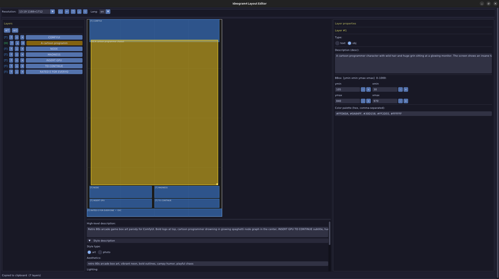
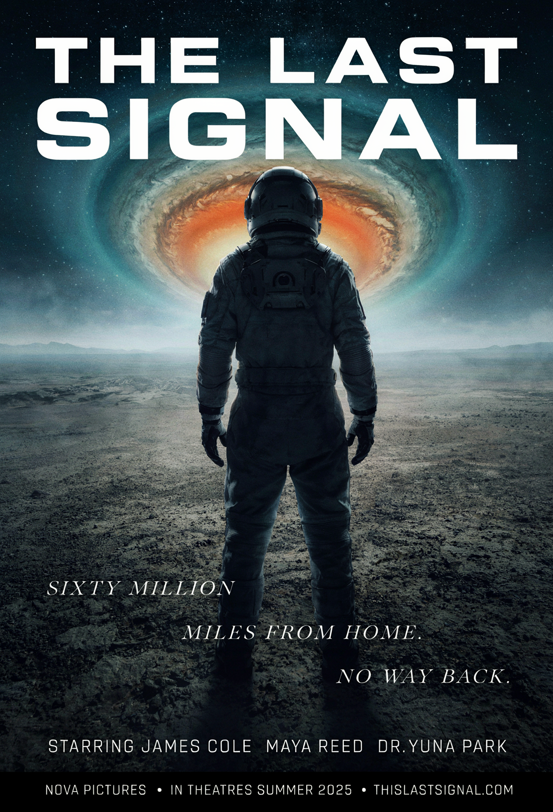
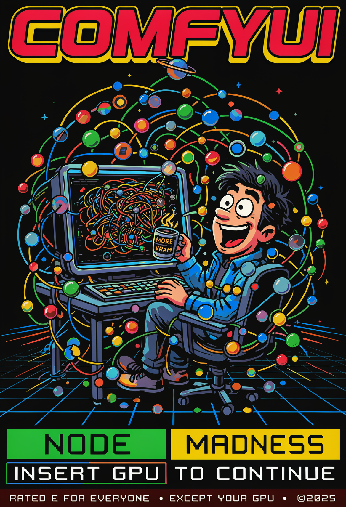

# Ideogram4 Layout Editor

> GUI layer editor for composing structured [Ideogram 4](https://ideogram.ai/) image-generation prompts




## What it is

Ideogram 4 accepts structured JSON prompts where every region of the image is described separately with a bounding box. Writing these by hand is error-prone. This editor lets you draw bbox regions on a proportional canvas (like Photoshop's layer panel), set text/style properties per layer, and export a ready-to-paste JSON prompt in one click.

## Example outputs

| Sci-fi movie poster (`photo` mode) | ComfyUI arcade parody (`art` mode) |
|---|---|
|  |  |

Prompt files for both are in `examples/` — open them with File → Open to explore the layout.

## Features

- Draw and resize `text` / `obj` bbox layers on a proportional canvas
- Layer panel with reorder (↑↓), delete, multi-layer support
- Properties panel: description, color palette, optional text content
- **Photo / Art style toggle** — correct key order per Ideogram 4 schema
- Undo / redo (`Ctrl+Z` / `Ctrl+Y`)
- Save / load JSON, copy prompt to clipboard
- 8 resolution presets (9:16 portrait → 16:9 landscape)
- RU / EN UI language switch
- Dark theme (Catppuccin Mocha)
- Draggable horizontal splitter between canvas and style fields

## Install

```bash
git clone https://github.com/vimcomes/ideogram4-editor.git
cd ideogram4-editor
python3 -m venv venv
source venv/bin/activate          # Windows: venv\Scripts\activate
pip install -r requirements.txt
```

## Run

```bash
./run.sh          # Linux / macOS  (creates venv automatically on first run)
run.bat           # Windows        (same auto-venv logic)
```

## How to use

1. **Choose resolution** — pick a preset from the top-left dropdown (e.g. `9:16 1168×1712`)
2. **Add layers** — click `⊕T` to add a text layer or `⊕O` for an object layer, then draw a bbox on the canvas
3. **Edit properties** — select a layer and fill in *Description*, *Text* (for text layers), and *Color palette* in the right panel
4. **Fill style fields** — expand *Style description*, choose Art or Photo mode, fill in aesthetics / lighting / medium
5. **Copy or save** — click `❐` to copy the JSON to clipboard, or `▽` to save to a file
6. **Undo** — `Ctrl+Z` steps back one action at a time

**Tips:**
- Drag the horizontal bar between canvas and style fields to resize them
- Long text strings in `text` layers should be split across multiple short bbox rows — the model handles short lines better
- Load `examples/magazine_cover.json` or `examples/scifi_poster.json` to see a complete prompt

## Prompt format

```json
{
  "high_level_description": "A product poster for a smartwatch",
  "style_description": {
    "aesthetics": "clean, minimal, soft shadows",
    "lighting": "soft studio light, no hard shadows",
    "medium": "photograph",
    "photo": "85mm, f/2.8, shallow depth of field"
  },
  "compositional_deconstruction": {
    "background": "Soft grey gradient",
    "elements": [
      {
        "type": "obj",
        "bbox": [100, 200, 800, 800],
        "desc": "Smartwatch hero shot",
        "color_palette": ["#1a1a2e", "#c0c0c0"]
      },
      {
        "type": "text",
        "bbox": [820, 100, 880, 900],
        "text": "NOVA X1",
        "desc": "Product name — bold white sans-serif",
        "color_palette": ["#ffffff"]
      }
    ]
  }
}
```

`bbox` is `[ymin, xmin, ymax, xmax]` in 0–1000 relative coordinates (resolution-independent).  
`style_description` key order matters — the editor handles it automatically based on Art/Photo mode.

## Development

```bash
pip install -r requirements-dev.txt
python -m pytest -q          # 50 tests
```

## Architecture

| File | Responsibility |
|------|----------------|
| `state.py` | Global mutable state + canvas geometry |
| `geometry.py` | Coordinate transforms, hit-test, mouse→canvas |
| `handlers.py` | Mouse FSM (press → drag → release) + keyboard |
| `toolbar.py` | Toolbar callbacks: add layer, new document, presets, i18n |
| `ui.py` | DPG window layout (3-column: layers \| canvas+fields \| properties) |
| `panels.py` | Layer list + properties panel |
| `draw.py` | Drawlist rendering |
| `prompt_io.py` | Save/load JSON, clipboard, overwrite confirmation |
| `history.py` | Undo/redo |
| `theme.py` | Global dark theme (Catppuccin Mocha) |
| `i18n.py` | RU/EN strings |
| `main.py` | Entry point + render loop |

## License

MIT — see [LICENSE](LICENSE).
